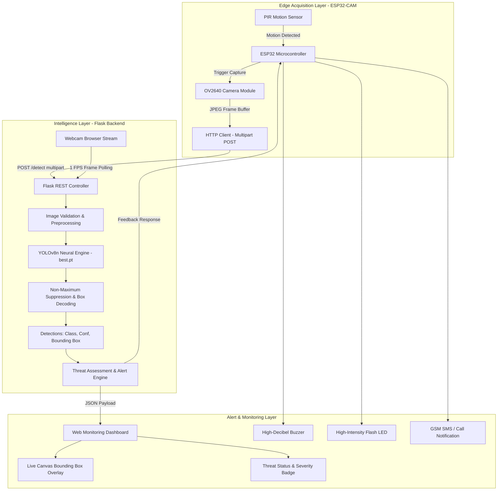
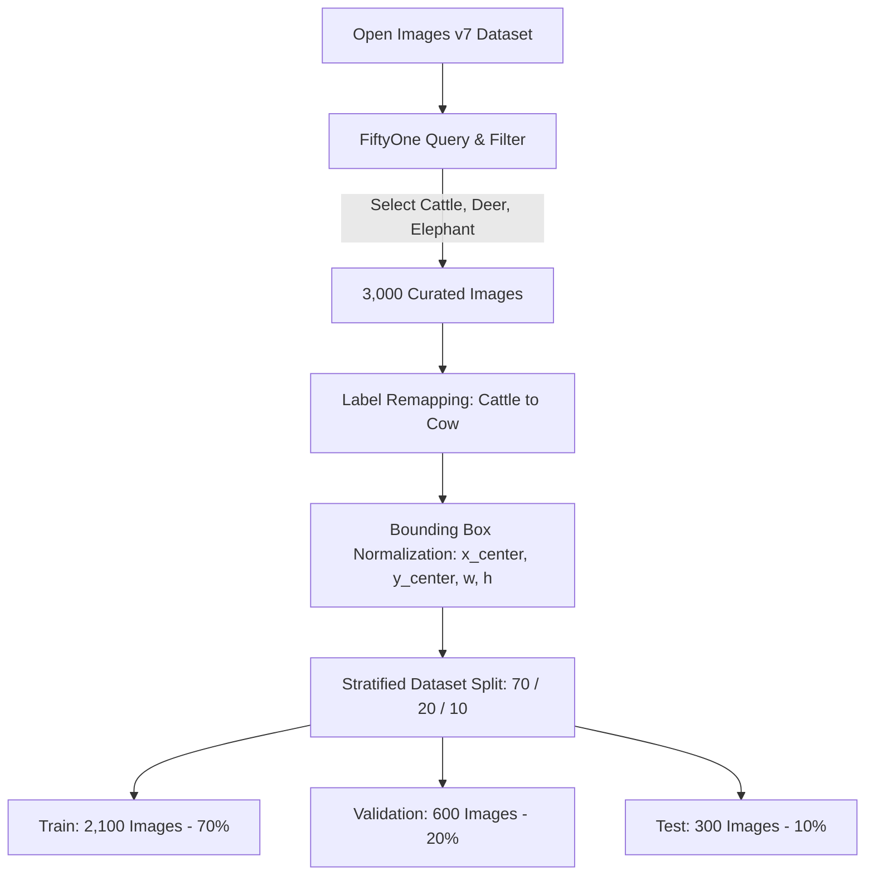

<div align="center">

# 🌾 Crop Suraksha Kavach (फसल सुरक्षा कवच)
### *AI-Powered Agricultural Wildlife Detection & Smart Threat Defense System*

[](https://www.python.org/)
[](https://flask.palletsprojects.com/)
[](https://ultralytics.com)
[](https://pytorch.org/)
[](https://www.espressif.com/)
[](LICENSE)

<p align="center">
  <b>Protecting Farmlands • Preventing Human-Wildlife Conflicts • Real-Time AI Inference</b>
</p>

---

</div>

## 📌 Table of Contents
- [Overview](#-overview)
- [Key Features](#-key-features)
- [System Architecture](#-system-architecture)
- [Machine Learning Architecture](#-machine-learning-architecture)
  - [Model Network & Pipeline](#model-network--pipeline)
  - [Dataset & Annotation Engineering](#dataset--annotation-engineering)
  - [Training & Hyperparameters](#training--hyperparameters)
  - [Model Evaluation & Benchmarks](#model-evaluation--benchmarks)
- [Alert & Defense Mechanism](#-alert--defense-mechanism)
- [Hardware & IoT Integration](#-hardware--iot-integration)
- [Project Directory Structure](#-project-directory-structure)
- [API Reference](#-api-reference)
- [Installation & Getting Started](#-installation--getting-started)
- [Roadmap & Future Scope](#-roadmap--future-scope)
- [License & Acknowledgments](#-license--acknowledgments)

---

## 🌟 Overview

**Crop Suraksha Kavach** is an edge-ready, AI-driven agricultural surveillance and automated alerting ecosystem. Crop damage and human casualties caused by wild and stray animals (such as **Elephants**, **Deer**, and **Cows**) represent major challenges for farming communities worldwide.

This project delivers an end-to-end intelligent solution comprising:
1. **Custom-trained YOLOv8n Object Detection Network** optimized for high-accuracy wildlife localization and classification.
2. **Flask REST API Engine** managing frame processing, bounding box calculation, and threat classification.
3. **Real-Time Web Dashboard** providing live camera stream monitoring, dynamic bounding boxes, and instant alert cards.
4. **ESP32-CAM Edge Node** featuring PIR motion-activated frame capture and multi-tier local deterrent triggers (Flash LED, Buzzer, GSM).

---

## ⚡ Key Features

- 🎯 **Targeted Animal Classification**: High-precision recognition of critical crop-raiding species (**Cow**, **Deer**, **Elephant**).
- ⚡ **Low-Latency Edge Inference**: Optimized YOLOv8n architecture designed for real-time CPU/Edge deployment.
- 🚨 **Multi-Tier Threat Matrix**: Dynamic response levels (**LOW**, **MEDIUM**, **HIGH**) triggering tailored deterrent protocols.
- 📹 **Live Web Surveillance Dashboard**: Clean browser interface supporting live webcam streaming, multi-object bounding box overlays, and live status updates.
- 🛰️ **IoT Hardware Support**: Complete ESP32-CAM sketch with PIR motion wake-up, HTTP multipart frame upload, and pin-level deterrent control.
- 🛠️ **Modular & Cross-Platform**: Clean, portable Python backend supporting Windows, Linux, and macOS.

---

## 🏗️ System Architecture

The following diagram illustrates the end-to-end dataflow and communication between hardware sensors, the AI backend, and user interfaces:



---

## 🧠 Machine Learning Architecture

### Model Network & Pipeline

The core detection engine is powered by **YOLOv8n (Nano)**, designed for optimal trade-off between spatial feature extraction and low computational footprint.

```mermaid
flowchart LR
    subgraph INPUT [Input Layer]
        IMG[Input Frame<br/>640 x 640 x 3]
    end

    subgraph BACKBONE [Backbone - Modified CSPDarknet]
        C1[Conv P1/2] --> C2[Conv P2/4]
        C2 --> C2F1[C2f Module]
        C2F1 --> C3[Conv P3/8]
        C3 --> C2F2[C2f Module P3]
        C2F2 --> C4[Conv P4/16]
        C4 --> C2F3[C2f Module P4]
        C2F3 --> C5[Conv P5/32]
        C5 --> SPPF[SPPF Spatial Pyramid Pooling]
    end

    subgraph NECK [Neck - PANet Feature Pyramid]
        SPPF --> UPSAMPLE1[Upsample 2x]
        UPSAMPLE1 --> CONCAT1[Concat & C2f]
        CONCAT1 --> UPSAMPLE2[Upsample 2x]
        UPSAMPLE2 --> CONCAT2[Concat & C2f - Scale 80x80]
        CONCAT2 --> DOWN1[Downsample Conv]
        DOWN1 --> CONCAT3[Concat & C2f - Scale 40x40]
        CONCAT3 --> DOWN2[Downsample Conv]
        DOWN2 --> CONCAT4[Concat & C2f - Scale 20x20]
    end

    subgraph HEAD [Decoupled Head - Anchor-Free]
        CONCAT2 --> H1[Cls Loss BCE + Reg Loss CIoU/DFL]
        CONCAT3 --> H2[Cls Loss BCE + Reg Loss CIoU/DFL]
        CONCAT4 --> H3[Cls Loss BCE + Reg Loss CIoU/DFL]
    end

    IMG --> C1
    H1 --> OUTPUT[Decoded Bounding Boxes<br/>Class Scores: Cow, Deer, Elephant]
    H2 --> OUTPUT
    H3 --> OUTPUT
```



#### Key Architecture Highlights:
- **Anchor-Free Detection**: Directly predicts the distance from bounding box centers, eliminating manually tuned anchor priors.
- **C2f Cross-Stage Partial Bottlenecks**: Combines high-level semantic features with low-level geometric details for superior small/medium animal detection.
- **Task-Aligned Assigner (TAL)**: Optimizes classification confidence and bounding box alignment jointly.

---

### Dataset & Annotation Engineering

The dataset was curated and converted using **FiftyOne** and the **Open Images v7** repository:



| Subset | Sample Count | Ratio | Purpose |
|---|---|---|---|
| **Train** | 2,100 | 70% | Network weight optimization & gradient backpropagation |
| **Validation** | 600 | 20% | Epoch-wise metric validation & early stopping |
| **Test** | 300 | 10% | Unseen benchmark evaluation & generalization testing |
| **Total** | **3,000** | **100%** | Comprehensive agricultural wildlife dataset |

---

### Training & Hyperparameters

```bash
yolo detect train data=dataset/data.yaml model=yolov8n.pt epochs=50 imgsz=640 batch=8 device=cpu
```

| Parameter | Configuration | Parameter | Configuration |
|---|---|---|---|
| **Base Architecture** | YOLOv8n (Nano) | **Optimizer** | AdamW / SGD Auto |
| **Epochs** | 50 | **Learning Rate** | $0.01$ (with cosine decay) |
| **Image Resolution** | $640 \times 640$ | **Batch Size** | 8 |
| **Loss Functions** | CIoU + DFL + BCE | **Target Classes** | 3 (Cow, Deer, Elephant) |

---

### Model Evaluation & Benchmarks

The trained `best.pt` model was evaluated on the independent 300-image test split:

<div align="center">

| Metric | Overall Score |
|---|---|
| 🎯 **Precision** | **0.845 (84.5%)** |
| 🔍 **Recall** | **0.671 (67.1%)** |
| 📈 **mAP@50** | **0.776 (77.6%)** |
| 📊 **mAP@50-95** | **0.526 (52.6%)** |

</div>

#### Class-Wise Performance Breakdown (mAP@50)

```text
Elephant  ████████████████████████████████████ 85.3%
Deer      ███████████████████████████████▍     78.7%
Cow       ███████████████████████████▌         68.9%
```

---

## 🚨 Alert & Defense Mechanism

The system enforces a tiered threat matrix based on animal hazard levels:

| Animal Class | Hazard Severity | System Message | Buzzer | Flash LED | GSM / SMS |
|---|---|---|:---:|:---:|:---:|
| 🐮 **Cow** | `LOW` | *Cow detected in monitoring zone.* | 🟢 ON | 🟢 ON | ⚪ OFF |
| 🦌 **Deer** | `MEDIUM` | *Deer detected! Stay alert.* | 🟢 ON | 🟢 ON | 🟢 ON |
| 🐘 **Elephant** | `HIGH` | *Elephant detected! Take immediate action.* | 🔴 ON | 🔴 ON | 🔴 ON |

---

## 🔌 Hardware & IoT Integration

The edge deployment integrates with an **AI-Thinker ESP32-CAM** module.

```
ESP32-CAM GPIO Pinout Mapping:
 ├── GPIO 13 ───> PIR Motion Sensor (Digital Input)
 ├── GPIO 12 ───> Active Buzzer (Digital Output)
 ├── GPIO 4  ───> Onboard High-Intensity Flash LED (Digital Output)
 └── OV2640  ───> High-Speed Parallel Camera Interface
```

### Hardware Operation Cycle:
1. **Sleep / Idle**: ESP32-CAM monitors PIR sensor on GPIO 13 in low-power state.
2. **Motion Detection**: Motion triggers an interrupt, powering on the camera sensor.
3. **Capture & Transmit**: Captures JPEG image and dispatches a multipart POST request to `http://<SERVER_IP>:5000/detect`.
4. **Autonomous Deterrent**: If response contains `success: true` and an animal class, local buzzer and flash LED are activated for 3 seconds.

---

## 📂 Project Directory Structure

```
Crop-Suraksha-Kavach/
├── backend/
│   ├── __init__.py           # Package initializer
│   ├── alert.py              # Alert generation & hardware trigger dispatcher
│   ├── app.py                # Flask REST API server (/detect, /health, /)
│   ├── config.py             # Server, model paths, & threat config
│   ├── detector.py           # YOLOv8 inference wrapper & box decoders
│   └── requirements.txt      # Backend dependencies
├── dataset/
│   └── data.yaml             # YOLO class names & dataset paths
├── frontend/
│   ├── index.html            # Web surveillance dashboard markup
│   ├── script.js             # Camera streaming, canvas bounding boxes, & polling
│   └── style.css             # Responsive styling & status badge themes
├── hardware/
│   └── esp32_cam/
│       └── esp32_cam.ino     # ESP32-CAM Arduino sketch (PIR + HTTP upload)
├── ml_model/
│   ├── custom_export_yolo.py # FiftyOne Open Images v7 dataset exporter
│   ├── weights/
│   │   └── best.pt           # Trained YOLOv8n weights
│   └── yolov8n.pt            # Base pretrained model
├── test_images/              # Verification test images
│   ├── cow.jpg
│   ├── deer.jpg
│   └── elephant.jpg
├── .gitignore                # Git exclusion rules
├── LICENSE                   # MIT License
├── pyproject.toml            # Project metadata
├── requirements.txt          # Root Python dependencies
└── vercel.json               # Deployment configuration
```

---

## 🌐 API Reference

### 1. Project Info & Status
- **Endpoint**: `GET /`
- **Response**:
```json
{
  "name": "Crop Suraksha Kavach API",
  "status": "online",
  "version": "1.0.0",
  "supported_classes": ["cow", "deer", "elephant"]
}
```

### 2. Health Check
- **Endpoint**: `GET /health`
- **Response**:
```json
{
  "model_loaded": true,
  "status": "healthy"
}
```

### 3. Animal Detection
- **Endpoint**: `POST /detect`
- **Content-Type**: `multipart/form-data`
- **Body**: `image` (JPEG/PNG file)
- **Response**:
```json
{
  "success": true,
  "total_detected": 1,
  "detections": [
    {
      "animal": "elephant",
      "confidence": 0.924,
      "bounding_box": [183.34, 54.18, 488.84, 330.87]
    }
  ],
  "alerts": [
    {
      "animal": "elephant",
      "severity": "HIGH",
      "message": "Elephant detected! Take immediate action.",
      "timestamp": "2026-08-31 21:29:14",
      "buzzer": true,
      "led": true,
      "gsm": true
    }
  ]
}
```

---

## 🚀 Installation & Getting Started

### 1. Clone the Repository
```bash
git clone https://github.com/sejalgajbhiye-ui/Crop-Suraksha-Kavach.git
cd Crop-Suraksha-Kavach
```

### 2. Setup Virtual Environment & Dependencies
```bash
# Create and activate virtual environment
python -m venv venv

# Windows:
venv\Scripts\activate
# Linux/macOS:
# source venv/bin/activate

# Install requirements
pip install -r requirements.txt
```

### 3. Start the Backend API Server
```bash
python backend/app.py
```
Server runs on `http://127.0.0.1:5000`.

### 4. Launch Frontend Monitoring Dashboard
- Open [`frontend/index.html`](file:///d:/Interview%20Preparation%20Material/TOP_PROJECTS/Crop_Suraksha_Kavach/frontend/index.html) in your web browser, **or**
- Serve via Python:
```bash
python -m http.server 8000 --directory frontend
```
Then visit `http://localhost:8000`.

---

## 🔮 Roadmap & Future Scope

- [x] YOLOv8n model training on Cow, Deer, Elephant.
- [x] Flask REST API with cross-platform upload handlers.
- [x] Real-time browser surveillance dashboard with multi-box canvas rendering.
- [x] ESP32-CAM firmware with PIR motion sensor integration.
- [ ] Edge TensorRT / ONNX runtime conversion for sub-50ms inference.
- [ ] Integration of LoRaWAN telemetry for long-range remote farmlands.
- [ ] SMS & automated phone call dispatch via Twilio / GSM SIM800L.
- [ ] Night-vision thermal / IR camera support.

---

## 📄 License & Acknowledgments

This project is open-source under the **MIT License**. See [`LICENSE`](LICENSE) for complete details.

Special thanks to:
- **Ultralytics** for the [YOLOv8 framework](https://github.com/ultralytics/ultralytics).
- **Google Open Images v7** and **FiftyOne** for dataset tooling.
- The open-source computer vision and IoT communities.
