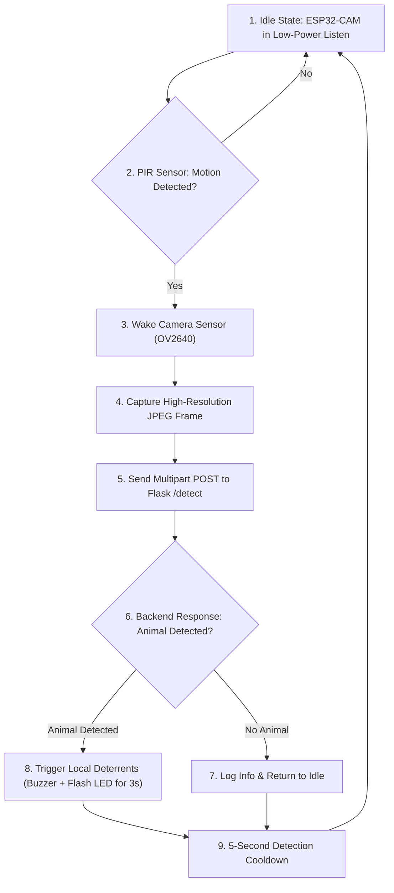

# 📡 Crop Suraksha Kavach - Hardware Architecture & Deployment Guide

This directory contains the firmware, pinout configurations, circuit diagrams, and setup instructions for deploying the **ESP32-CAM edge node** in agricultural fields.

---

## 📋 Components Required

| Component | Specification | Purpose |
|---|---|---|
| **Microcontroller** | AI-Thinker ESP32-CAM (OV2640 Camera) | Image capture, Wi-Fi communication, and GPIO control |
| **Motion Sensor** | HC-SR501 / AM312 PIR Sensor | Detects animal motion in the field (3–7m range) |
| **Flashing Module** | FT232RL FTDI USB-to-TTL Programmer | Uploading Arduino code via UART |
| **Deterrent Output** | 5V Active Buzzer | Audible local deterrent against animals |
| **Lighting Deterrent** | Onboard Flash LED (GPIO 4) / External High-Power LED | Visual deterrent in low-light / night conditions |
| **GSM Module (Optional)** | SIM800L GSM/GPRS Module | Direct SMS alert transmission to farmers |
| **Power Supply** | 5V, 2A DC Adapter / 18650 Li-ion Battery with LM2596 Buck Converter | Stable power supply to prevent ESP32 brownouts |

---

## 🔌 Circuit Pinout & Wiring Table

```
      +------------------------------------------+
      |               ESP32-CAM                  |
      |                                          |
      |   [GND] ------------> Common GND         |
      |   [5V]  ------------> +5V (2A Source)    |
      |   [GPIO 13] --------> PIR Sensor Output  |
      |   [GPIO 12] --------> Buzzer (+ pin)     |
      |   [GPIO 4]  --------> Flash LED (Internal|
      |   [GPIO 0]  ---+                         |
      |                | (Bridge during Flash)   |
      |   [GND]     ---+                         |
      +------------------------------------------+
```

### Pin-by-Pin Connection Matrix

| ESP32-CAM Pin | Connected Peripheral | Peripheral Pin | Note |
|---|---|---|---|
| **5V** | Power Source | +5V DC | Ensure minimum 2A capability |
| **GND** | Power / Sensors | GND | Common ground across all modules |
| **GPIO 13** | HC-SR501 PIR Sensor | `OUT` (Signal) | Digital Input (HIGH on motion) |
| **GPIO 12** | Active Buzzer | `+` (Positive) | Digital Output (Active HIGH) |
| **GPIO 4** | Onboard Flash LED | Internal LED | High-intensity white flash |
| **U0TXD (GPIO 1)** | FTDI Programmer | `RXD` | For uploading firmware |
| **U0RXD (GPIO 3)** | FTDI Programmer | `TXD` | For uploading firmware |
| **GPIO 0** | FTDI Ground / Jumper | `GND` | **Connect to GND during flashing; Disconnect to run** |

---

## ⚡ Arduino IDE Setup & Flashing Instructions

### 1. Arduino IDE Prerequisites
1. Install **Arduino IDE** (v1.8.19 or v2.x).
2. Open **File ➔ Preferences**.
3. In *Additional Boards Manager URLs*, add:
   ```
   https://raw.githubusercontent.com/espressif/arduino-esp32/gh-pages/package_esp32_index.json
   ```
4. Go to **Tools ➔ Board ➔ Boards Manager...**, search for `esp32` by *Espressif Systems*, and click **Install**.

### 2. Board Configuration Settings
Under the **Tools** menu, configure the following:
- **Board**: `AI Thinker ESP32-CAM`
- **CPU Frequency**: `240MHz (WiFi/BT)`
- **Flash Frequency**: `80MHz`
- **Flash Mode**: `QIO`
- **Partition Scheme**: `Huge APP (3MB No OTA/1MB SPIFFS)`
- **Core Debug Level**: `None` (or `Verbose` for debugging)
- **Port**: Select your FTDI COM port (e.g., `COM3`, `COM4`)

### 3. Firmware Configuration
Open [`hardware/esp32_cam/esp32_cam.ino`](esp32_cam/esp32_cam.ino) and update your Wi-Fi credentials and Flask Backend server IP:

```cpp
const char* WIFI_SSID     = "YOUR_WIFI_SSID";
const char* WIFI_PASSWORD = "YOUR_WIFI_PASSWORD";
const char* SERVER_URL    = "http://192.168.1.100:5000/detect";
```

### 4. Upload Steps
1. Connect **GPIO 0 to GND** on the ESP32-CAM.
2. Connect FTDI to your PC via USB.
3. Press the **RST (Reset)** button on the ESP32-CAM.
4. In Arduino IDE, click **Upload** (Arrow icon).
5. When upload completes (`100% Done uploading`), **disconnect GPIO 0 from GND**.
6. Press the **RST (Reset)** button once more.
7. Open **Serial Monitor** at baud rate **115200** to observe startup and Wi-Fi connection.

---

## 🔄 Edge Operational Workflow



---

## 🛠️ Troubleshooting & FAQs

### 1. Brownout Detector Triggered (`Brownout detector was triggered`)
- **Cause**: Inadequate current supply when Wi-Fi and camera draw peak current (~350–500mA).
- **Fix**: Power the ESP32-CAM with a dedicated 5V 2A power source and add a $100\mu\text{F} - 470\mu\text{F}$ electrolytic capacitor across the 5V and GND pins.

### 2. Camera Init Failed (`0x20001` or `0x20002`)
- **Cause**: OV2640 camera ribbon cable loose or improper board selected.
- **Fix**: Re-seat the camera ribbon connector gently and ensure board is set to `AI Thinker ESP32-CAM`.

### 3. Packet Transmission Failed
- **Cause**: Incorrect backend server IP address or firewall blocking port 5000.
- **Fix**: Verify your computer's local IP (`ipconfig` on Windows) and ensure your computer and ESP32-CAM are connected to the same Wi-Fi network. Allow inbound port 5000 in Windows Defender Firewall.
